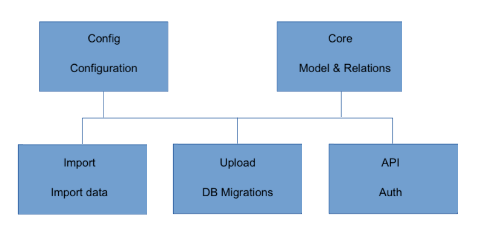

# How to add a new data collection to GOB

Adding a data collection to GOB requires a few steps and involves a number of GOB Components

## Model definition
- [GOB Data model](https://github.com/Amsterdam/GOB-Core/blob/master/gobcore/model/gobmodel.json)

The first step is to define the model.
Data in GOB is organised in catalogs and collections.
An example is the stadsdelen collection in the gebieden catalog.

The following information need to be registered:
- name and abbreviaton
- version
- the identification attribute
- and for every attribute at least a name, type and description

Attributes that are references to other collections should speficy the catalog and collection to which the attribute refers.

## Model relations
- [GOB Data relations](https://github.com/Amsterdam/GOB-Core/blob/master/gobcore/sources/gobsources.json)

Relations are registered separately from the model.
This is because the implementation of a relation can differ per application.
The one application for example can refer to another collection by a code and another can do the same by an id.

For every reference attribute the referenced attribute in the other collection needs to be defined as well as the method to resolve the relation.
Currently the equals and lies_in methods have been implemented to resolve a relation.

## Scenario

## GOB-Core release

When the model and the relations have been defined a new version of GOB-Core as to be released.
The Import, Upload and API modules need to be updated with the new release.
GOB-Upload is the “owner” of the storage database and will have to generate and run the required migration:
- alembic revision --autogenerate -m "any data"
- controleer de migratie
- start gobupload

## Import data definition

- [GOB Data Import definitions](https://github.com/Amsterdam/GOB-Import/tree/develop/src/data)

With the new release of GOB-Core GOB knows the new data collection.
The next part is to import the data from a specific source.

Importing data is done by means of an import definition.
An import definition contains information about the source and the mapping of the data in the source to the GOB Model.
The mapping tells which attribute of the source maps onto which attribute in the GOB Model.

## Import data

The data can now be imported in GOB and becomes available in the API’s.
From there on the data can be exported to export files, analysis databases, etcetera.

## Testing

The access to secured data can be tested by simulating gatekeeper headers.

For example:

curl -H "X-Auth-Roles:gob_adm,gob_secure_attrs" -H "X-Auth-Userid:user" http://localhost:8141/gob/secure/test_catalogue/anydata/ | json_pp

## References:
- [GOB Documentation](https://github.com/Amsterdam/GOB-Documentation)
